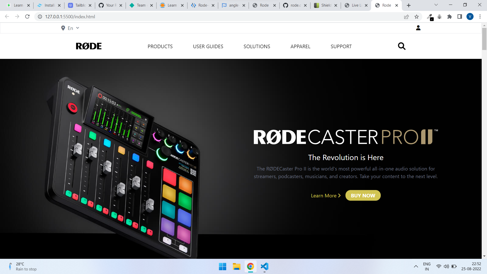
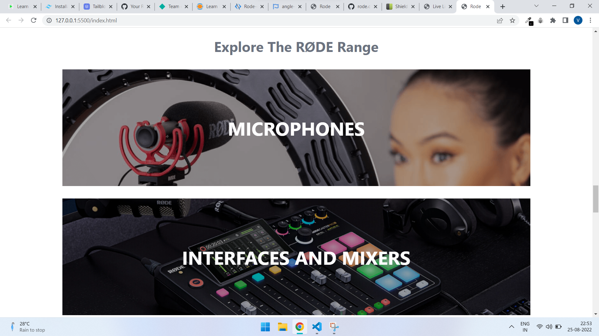
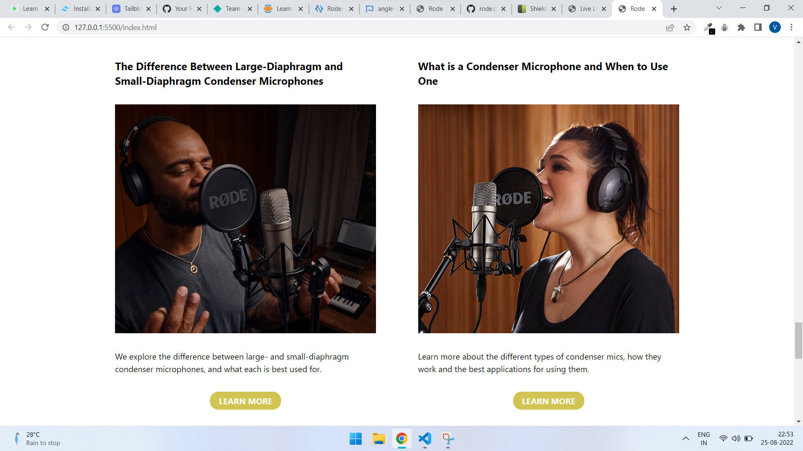
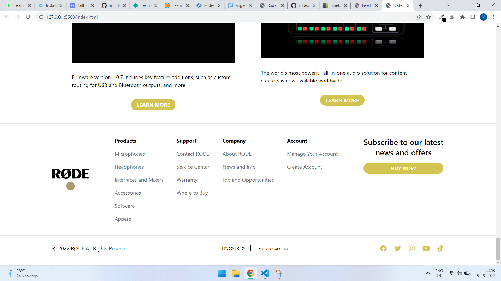

# **Rode UI Clone by Vinay Pratap Singh** #

# **Description** #
This website is complete clone of one of the most popular website rode.com.
This website contains all the information similar as of it's original website instead of some colours which are modified according to the taste of mine.

This website is completely mobile as well as pc friendly, which means the viewing experience will be amazing in any of the two screen size.

# **Technology Used** #
1. Pure HTML
2. Tailwind CSS

> No other framework or libraries has been used in this project except the given one on the top.

# **Live Link** #
This website is live for you to check and recommend some updates or issues to improve it.

# **Output Samples** #
    
    
    
    